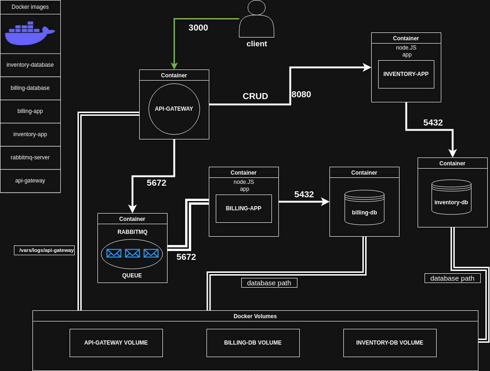

# Play with Containers

This project implements a microservices architecture using Docker containers for the crud-master services. The implementation focuses on containerization concepts, Docker networking, volumes, and service orchestration using Docker Compose.

## Table of Contents

-   [Architecture Overview](#architecture-overview)
-   [Prerequisites](#prerequisites)
-   [Project Structure](#project-structure)
-   [Configuration](#configuration)
-   [Setup Instructions](#setup-instructions)
-   [Running the Application](#running-the-application)
-   [Testing the API](#testing-the-api)
-   [Postman Collection](#postman-collection)
-   [Container Details](#container-details)
-   [Volumes](#volumes)
-   [Troubleshooting](#troubleshooting)

## Architecture Overview

The application consists of the following microservices:

-   **API Gateway**: Routes requests to appropriate services
-   **Inventory Service**: Manages movie inventory with CRUD operations
-   **Billing Service**: Handles billing operations via RabbitMQ
-   **PostgreSQL Databases**: Separate databases for inventory and billing
-   **RabbitMQ**: Message queue for asynchronous communication



## Prerequisites

-   Docker 
-   Docker Compose
-   Git

## Project Structure

The project structure is organized as follows:


## Configuration

The project uses environment variables for configuration. Create a `.env` file in the root directory based on the provided `.env.example`:

```
# API Gateway
API_GATEWAY_PORT=3000

# Inventory Service
INVENTORY_DB_NAME=movies
INVENTORY_DB_USER=inventory_user
INVENTORY_DB_PASSWORD=inventory_password

# Billing Service
BILLING_DB_NAME=orders
BILLING_DB_USER=billing_user
BILLING_DB_PASSWORD=billing_password

# RabbitMQ
RABBITMQ_USER=guest
RABBITMQ_PASSWORD=guest

```

**Important:** Never commit your `.env` file to version control. The `.env` file is included in `.gitignore`.

## Setup Instructions

1.  Clone the repository:
    
    ```bash
    git clone https://01.kood.tech/git/tdubolaz/play-with-containers
    cd play-with-containers
    ```
    
2.  Create the environment file:
    
    ```bash
    cp .env.example .env
    ```
    
3.  Edit the `.env` file with your preferred configuration values.
    
4.  Build and start the containers:
    
    ```bash
    docker-compose up -d
    ```
    

## Running the Application

After setup, all services will be automatically started. The API Gateway will be accessible at http://localhost:3000.

### Starting and Stopping Services

-   Start all services:
    
    ```bash
    docker-compose up -d
    
    ```
    
-   Stop all services:
    
    ```bash
    docker-compose down
    
    ```
    
-   View logs:
    
    ```bash
    docker-compose logs -f
    
    ```
    
-   View logs for a specific service:
    
    ```bash
    docker-compose logs -f api-gateway-app
    
    ```
    

## Testing the API

You can access the OpenAPI documentation at http://localhost:3000/api-docs/ to view and test all available endpoints.

### Example API Requests using cURL

You can test the API using cURL commands from your terminal:

#### Create a Movie

```bash
curl -X POST http://localhost:3000/api/movies \
  -H "Content-Type: application/json" \
  -d '{"title": "The Matrix", "description": "A computer hacker learns about the true nature of reality"}'

```

#### Get All Movies

```bash
curl -X GET http://localhost:3000/api/movies

```

#### Get Movie by ID

```bash
curl -X GET http://localhost:3000/api/movies/1

```

#### Update a Movie

```bash
curl -X PUT http://localhost:3000/api/movies/1 \
  -H "Content-Type: application/json" \
  -d '{"title": "The Matrix Reloaded", "description": "The sequel to The Matrix"}'

```

#### Delete a Movie

```bash
curl -X DELETE http://localhost:3000/api/movies/1

```

#### Send a Billing Request

```bash
curl -X POST http://localhost:3000/api/billing \
  -H "Content-Type: application/json" \
  -d '{"user_id": 123, "number_of_items": 2, "total_amount": 29.99}'

```

## Postman Collection

For easier testing, you can use the Postman collection included with this project.

### Import the Collection

1.  Open Postman
2.  Click on "Import" button
3.  Select the file `postman/play-with-containers.postman_collection.json`

### Collection Contents

The Postman collection includes pre-configured requests for:

#### Movies API

-   Create a Movie (POST /api/movies)
-   Get All Movies (GET /api/movies)
-   Get Movie by ID (GET /api/movies/{id})
-   Get Movie by Name (GET /api/movies?title={name})
-   Update a Movie (PUT /api/movies/{id})
-   Delete a Movie (DELETE /api/movies/{id})
-   Delete All Movies (DELETE /api/movies)

#### Billing API

-   Send a Billing Request (POST /api/billing)

### Configure Environment (if needed)

1.  In Postman, create a new environment
2.  Set the `base_url` variable to `http://localhost:3000`
3.  Apply the environment to use with the collection

## Container Details

### api-gateway-app

-   **Base Image**: Debian or Alpine (penultimate stable version)
-   **Exposed Port**: 3000
-   **Restart Policy**: Always
-   **Volume**: api-gateway-logs

### inventory-app

-   **Base Image**: Debian or Alpine (penultimate stable version)
-   **Exposed Port**: 8080 (internal)
-   **Restart Policy**: Always
-   **Dependencies**: inventory-db

### inventory-db

-   **Base Image**: Debian or Alpine (penultimate stable version) with PostgreSQL
-   **Exposed Port**: 5432 (internal)
-   **Restart Policy**: Always
-   **Volume**: inventory-db-data

### billing-app

-   **Base Image**: Debian or Alpine (penultimate stable version)
-   **Exposed Port**: 8080 (internal)
-   **Restart Policy**: Always
-   **Dependencies**: billing-db, rabbit-queue

### billing-db

-   **Base Image**: Debian or Alpine (penultimate stable version) with PostgreSQL
-   **Exposed Port**: 5432 (internal)
-   **Restart Policy**: Always
-   **Volume**: billing-db-data

### rabbit-queue

-   **Base Image**: Debian or Alpine (penultimate stable version) with RabbitMQ
-   **Exposed Port**: 5672 (internal)
-   **Restart Policy**: Always

## Volumes

The project uses the following Docker volumes:

-   **inventory-db-data**: Persists inventory database data
-   **billing-db-data**: Persists billing database data
-   **api-gateway-logs**: Stores API Gateway logs


## Troubleshooting

### Common Issues

1.  **Services not starting properly**:
    
    -   Check if all required environment variables are set
    -   Verify port availability
    -   Check container logs with `docker-compose logs -f <service-name>`
2.  **Database connection issues**:
    
    -   Ensure database containers are running
    -   Check database credentials in `.env` file
    -   Verify network connectivity between services
3.  **RabbitMQ connection issues**:
    
    -   Verify RabbitMQ credentials
    -   Check if rabbit-queue container is running

### Restarting a Specific Service

If a service needs to be restarted:

```bash
docker-compose restart <service-name>

```

### Rebuilding Containers

If you need to rebuild containers after code changes:

```bash
docker-compose build --no-cache
docker-compose up -d

```

## License

This project is licensed under the MIT License - see the LICENSE file for details.